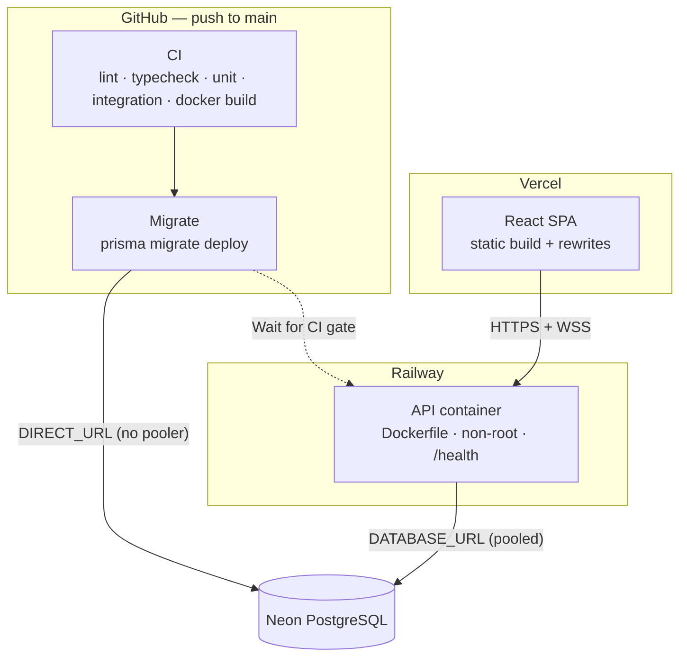

# Deployment

How this project runs in production, and what to do when deploying it yourself.

**Live:** API at [api.tanadon-i.com](https://api.tanadon-i.com/health) · SPA at [board.tanadon-i.com](https://board.tanadon-i.com)

## Topology



Three moving parts, three hosts:

| Component | Host | Build source |
|---|---|---|
| API + Socket.io + workers | Railway | `Dockerfile` (multi-stage, non-root) — config in `railway.toml` |
| React SPA | Vercel | Vite build, `vercel.json` in the client repo |
| PostgreSQL | Neon | managed |

Migrations do **not** run in the container — the runtime image omits devDependencies, so there is no Prisma CLI in it. They run in GitHub Actions instead (`.github/workflows/migrate.yml`).

## Deploy order matters

The database must be migrated **before** the new code reaches users. The pipeline enforces this:

1. Push to `main` → **CI** runs (lint, typecheck, unit, integration, migration drift, docker build).
2. **Migrate** workflow runs `prisma migrate deploy` against Neon.
3. Railway deploys — but only after checks pass, because **"Wait for CI" is enabled** in the Railway service settings.

> Turn **Wait for CI** on in Railway → service → Settings. Without it, Railway starts building the moment `main` moves and can put new code in front of an un-migrated database. This exact failure happened on 2026-07-17: the outbox code shipped before the `OutboxEvent` table existed.

`migrate deploy` is idempotent — with nothing pending it exits cleanly, so running it on every push is safe and also recovers from a previously failed run. It can be re-run by hand from the **Actions** tab (`workflow_dispatch`).

### Expand–contract migrations

Migrations are authored locally against the Postgres container in `../infra` and reach production only through the Migrate workflow. Development and production are **separate databases** — the exit path [ADR-0003](docs/adr/0003-shared-database-expand-contract.md) laid out, now taken.

The additive discipline stays, because it is what makes a deploy zero-downtime rather than because a shared database forces it. During a rollout, migrated schema and old code coexist for as long as the release takes:

1. New columns are nullable or defaulted; new tables and indexes are always safe.
2. Never rename in place — add the new column and backfill, or reuse the existing one (refresh-token hashes kept the `token` column for exactly this reason).
3. Contract — drop or rename — only in a *later* migration, once no deployed code reads the old shape.

Maintenance scripts under `scripts/` read `DATABASE_URL` from the local `.env`, which points at the local container. Pointing one at production is a deliberate act — check the connection string before running.

## Environment variables (API — Railway)

The schema in [src/shared/config/env.ts](src/shared/config/env.ts) is the source of truth; it is validated once at boot and the process **exits immediately** with a list of every offending variable if anything is wrong.

**Required — the app will not start without these:**

| Variable | Notes |
|---|---|
| `DATABASE_URL` | Neon **pooled** connection string (host contains `-pooler`) |
| `JWT_SECRET` | 32+ random chars — `node -e "console.log(require('crypto').randomBytes(32).toString('hex'))"` |
| `JWT_REFRESH_SECRET` | a *different* random secret |
| `GOOGLE_CLIENT_ID` / `GOOGLE_CLIENT_SECRET` / `GOOGLE_CALLBACK_URL` | callback must be the production URL |
| `GITHUB_CLIENT_ID` / `GITHUB_CLIENT_SECRET` / `GITHUB_CALLBACK_URL` | separate OAuth app from dev (see below) |

**Should be set in production — defaults are wrong for a deployed app:**

| Variable | Production value | What breaks if you forget |
|---|---|---|
| `NODE_ENV` | `production` | logger format and rate-limit tiers stay in dev mode. Already baked into the Dockerfile runner stage |
| `ALLOWED_ORIGIN` | SPA origin(s), comma-separated | CORS blocks every browser request |
| `FRONTEND_URL` | `https://board.tanadon-i.com` | invitation `acceptUrl` defaults to `localhost:5173` — invite links are unusable |
| `APP_URL` | `https://api.tanadon-i.com` | verification / reset links in email point at localhost |

**Optional:**

| Variable | Effect when set |
|---|---|
| `REDIS_URL` | Enables BullMQ job queue (email + outbox), the Socket.io Redis adapter, and a shared rate-limit store. **Unset is a supported mode** — every feature still works single-instance (email sends inline, outbox falls back to a poller). Required before scaling past one instance |
| `SENTRY_DSN` | Turns on error tracking. Left unset in dev |
| `SMTP_*`, `EMAIL_FROM` | Real mail delivery. Unset in dev logs the email body to the console instead |
| `PORT`, `LOG_LEVEL` | Default `3000` / `info`. Railway injects `PORT` |

### SMTP: Railway blocks the standard ports

Provider is **Resend**, and the port is the non-obvious part:

```
SMTP_HOST=smtp.resend.com
SMTP_PORT=2587          # NOT 25 / 465 / 587
SMTP_USER=resend
SMTP_PASS=<resend api key>
EMAIL_FROM=no-reply@tanadon-i.com
```

Railway blocks outbound 25, 465 and 587. Using them produces an `ETIMEDOUT` at the connection stage with no clearer error. The sending domain must be verified in Resend via DNS.

### OAuth: one app per environment

Redirect URIs are per-environment and GitHub allows only **one callback URL per OAuth app**, so dev and production need **two separate GitHub apps** — production credentials on Railway, dev credentials in local `.env`. Google tolerates multiple redirect URIs on one client, but its consent screen must be **In production**, not Testing.

Debug the URL the server actually builds:

```bash
curl -sI https://api.tanadon-i.com/api/v1/auth/google | grep -i location
```

Check `redirect_uri` in the `Location` header — it must match the provider console exactly.

## Environment variables (SPA — Vercel)

| Variable | Value |
|---|---|
| `VITE_API_URL` | `https://api.tanadon-i.com` |

Two traps, both previously hit:

- **The `https://` prefix is required.** Without a scheme, axios treats the value as a relative path, so requests go to the Vercel domain instead of the API — `POST` then returns **405**.
- **Vite inlines env at build time.** Changing the variable does nothing until you **redeploy**.

`vercel.json` supplies the SPA rewrite plus security headers. Its CSP `connect-src` must allow-list the API origin under **both** `https:` and `wss:`, or Socket.io is blocked in production.

## Database

`prisma.config.ts` reads a single `DIRECT_URL` for migrations.

- **`DATABASE_URL`** — pooled endpoint, used at runtime.
- **`DIRECT_URL`** — direct endpoint (drop `-pooler` from the host), used for migrations. Migrations must not go through a connection pooler.

The Migrate workflow reads it from the repo secret **`PROD_DIRECT_URL`**.

CI additionally runs a **migration drift check** (`prisma migrate diff --exit-code`) against a throwaway Postgres service container, which fails the build if `schema.prisma` was edited without a matching migration.

## Container

Multi-stage build — the builder installs full dependencies, runs `prisma generate` and compiles TypeScript; the runner installs production dependencies only and copies `dist/`, `generated/`, `tsconfig.json` and `prisma/`. `tsconfig.json` ships because `tsconfig-paths` resolves path aliases at runtime.

Runs as the non-root `node` user. `HEALTHCHECK` reads `PORT` from the environment rather than assuming 3000, since the platform injects its own port. Railway gates traffic on `GET /health` (`railway.toml`) and restarts on failure, up to 3 times.

Background workers (purge cron, email worker, outbox worker) currently run **in the API process** — see the comment block in [main.ts](main.ts). They communicate only through the queue and the database, so moving them to a dedicated entry point requires no changes to the Express app.

## Verifying a deploy

```bash
curl -s https://api.tanadon-i.com/health          # {"status":"ok","uptime":…}
curl -sI https://api.tanadon-i.com/api/v1/auth/google | grep -i location
```

Then load the SPA, sign in, and confirm a board update propagates to a second browser (proves the WSS path and CSP `connect-src` survived).

## Local development

```bash
cd ../infra && docker compose up -d    # Postgres + Redis
cd -
npm install
cp .env.example .env                   # defaults already point at the compose services
npx prisma migrate dev
npm run dev                            # http://localhost:3000
```

The compose project is pinned to the name `bootstrapper` so the volume is stable across restarts. `docker/init-test-db.sql` provisions the separate `bootstrapper_test` database used by `npm run test:integration` — integration tests write and delete real rows and must never share the dev database.

## Known gaps

- No `_dmarc` TXT record yet (`v=DMARC1; p=none;`) — affects deliverability reputation, not function.
- Background workers share the API process. Fine at current load; the seam to split them is already in place.
