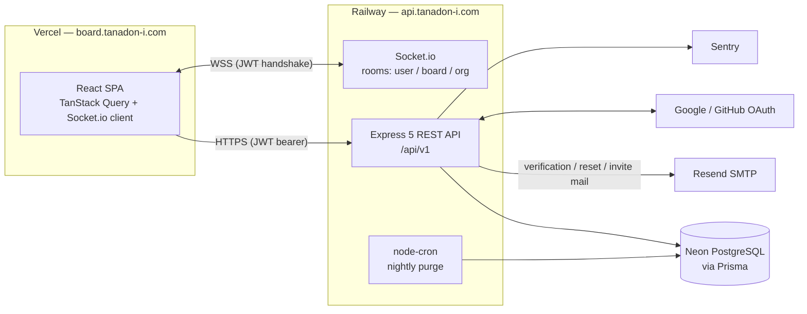

# Bootstrapper — Multi-Tenant Kanban SaaS (API)

A production-deployed, multi-tenant team task manager (think minimal Trello) built with **Clean Architecture**, hardened authentication, and real-time collaboration.

**Live demo:** [board.tanadon-i.com](https://board.tanadon-i.com) · API at `api.tanadon-i.com`
**Frontend repo:** [Bootstrapper-Client](https://github.com/FramNaVer/Bootstrapper-Client) (React 18 + Vite)

> Built as a learning + portfolio project — but deployed and used for real classroom teamwork. Every architectural decision is documented in [docs/adr](docs/adr).

---

## What it does

- **Organizations (tenants)** — create orgs, invite members by email or link, RBAC roles (`OWNER · ADMIN · MEMBER · VIEWER`), creator protection
- **Kanban boards** — lists & cards with fractional-position drag-and-drop, labels, assignees, comments, due dates, per-board activity log
- **Real-time** — live board updates, presence ("who's viewing"), instant notifications, org chat — all over Socket.io with per-room authorization
- **Org calendar** — cross-board due-date calendar per organization
- **Org chat** — one channel per org, cursor-paginated history + socket data push
- **Auth** — email/password with enforced email verification, password reset, Google & GitHub OAuth with account linking
- **Housekeeping** — soft delete with 30-day retention, nightly purge cron

## Tech stack

| Concern | Choice |
|--------|--------|
| Language | TypeScript (strict) |
| Runtime / framework | Node.js + Express 5 |
| Database | PostgreSQL (Neon) via Prisma 7 |
| Real-time | Socket.io (JWT-authenticated, room-based) |
| Auth | JWT (access + rotating refresh) · Passport OAuth (Google, GitHub) |
| Validation | Zod — requests (body & query) and environment |
| Email | Nodemailer → Resend SMTP (port 2587 — Railway blocks 25/465/587) |
| Jobs | node-cron (nightly purge) |
| Observability | Pino structured logs + correlation IDs · Sentry |
| Testing | Vitest — 100+ unit tests + supertest integration suite |
| Deploy | Docker (multi-stage, non-root) on Railway — see [DEPLOY.md](DEPLOY.md) |

## System overview



## Architecture

**Module-based Clean Architecture** — each module owns its four layers; dependencies always point inward. Modules never import each other's internals (only shared contracts).

```
src/
├── modules/
│   ├── auth/           # register, login, refresh rotation, OAuth, verify, reset
│   ├── organization/   # orgs, memberships, invitations, RBAC middleware
│   ├── board/          # boards, lists, cards, labels, assignees, comments, activity
│   ├── chat/           # org chat (messages, cursor pagination)
│   └── notification/   # user notifications (invite → bell)
│   └── <module>/
│       ├── domain/          # entities + repository interfaces (no dependencies)
│       ├── application/     # use cases (business rules), pure & unit-tested
│       ├── infrastructure/  # Prisma repositories, email service
│       └── presentation/    # routes (composition root), controllers, validators
└── shared/             # env config, prisma client, errors, middlewares,
                        # realtime (socket), jobs (purge cron), logging
```

**Key principles**

- **Dependency inversion** — use cases depend on repository *interfaces*; Prisma implementations are injected at the composition root (each module's route file).
- **Multi-tenancy** — shared schema with an `organizationId` discriminator on every tenant-scoped table. A single RBAC middleware (`requireRole`) resolves the caller's membership per request; every tenant query filters by `organizationId`.
- **Fail fast on config** — environment is validated once at boot with Zod; missing config crashes immediately with a clear message.
- **Expand–contract migrations** — dev and prod share one database, so every migration must be additive (see [ADR-0003](docs/adr/0003-shared-database-expand-contract.md)).

## Security

- **Hashed tokens at rest** — refresh / verification / reset / invitation tokens are stored as **SHA-256 hashes**, applied at the repository boundary so no code path can forget ([ADR-0002](docs/adr/0002-token-storage-and-rotation.md))
- **Refresh rotation + reuse detection** — every refresh rotates the pair; reuse of a revoked token revokes *all* of the user's sessions (theft signal)
- **Email verification enforced at login** — with identical error ordering to prevent user enumeration (verified check runs *after* password verification)
- **bcrypt cost 12** for passwords — single source of truth in one util
- **Tiered rate limiting** — login 20 / refresh 120 / general 600 per 15 min (tuned for classroom NAT sharing)
- **OAuth hardening** — per-environment OAuth apps, provider-verified emails mark accounts verified, account linking by verified email
- **Socket authorization** — JWT on handshake; board/org room joins re-check membership server-side
- **Headers** — Helmet on the API; strict CSP, `frame-ancestors 'none'`, and friends on the frontend (see client repo's `vercel.json`)

## Real-time design

| Event | Payload | Pattern | Why |
|-------|---------|---------|-----|
| `board:change` | none | **signal → refetch** | board state is complex; clients re-pull truth via TanStack Query |
| `board:presence` | user list | server-computed | names resolved from JWT server-side — not spoofable |
| `notification:new` | none | signal → refetch | bell badge is cheap to refetch |
| `chat:new` | full message | **data push** | chat needs instant append; refetching history per message is wasteful |

Two patterns on purpose — *invalidate over the wire* when state is complex, *data push* when latency matters and the payload is self-contained ([ADR-0005](docs/adr/0005-realtime-strategy.md)).

## Testing

```bash
npm test                  # unit tests — use cases with mocked repositories (fast, no DB)
npm run test:integration  # supertest against the real app + real database
```

- **Unit (100+)** — business rules: rotation & reuse detection, RBAC edge cases (creator protection, last-owner guard), enumeration-resistant error ordering, pagination cursor logic
- **Integration (24+)** — HTTP through real middleware + Prisma: RBAC per route, soft-delete filtering, cursor pagination walking pages without gaps/repeats

## Getting started

```bash
npm install
cp .env.example .env      # fill in values (see comments in the file)
npx prisma migrate dev    # apply schema
npm run dev               # http://localhost:3000
```

Without SMTP config, dev mode logs email links to the console instead of sending.

### Demo data

```bash
npx ts-node -r tsconfig-paths/register scripts/seed-demo.ts <password>
```

Creates (idempotently) a verified demo user with a sample org, boards, cards with due dates, and chat messages — handy for reviewers.

### Scripts

| Script | Description |
|--------|-------------|
| `npm run dev` | Dev server (ts-node) |
| `npm run build` / `npm start` | Compile & run production build |
| `npm test` / `npm run test:watch` | Unit tests |
| `npm run test:integration` | Integration tests (needs `DATABASE_URL`) |

## API surface (v1)

All routes live under `/api/v1`. Highlights:

| Area | Routes |
|------|--------|
| Auth | `POST /auth/register · /login · /refresh · /logout · /verify-email · /forgot-password · /reset-password` · `GET /auth/google · /auth/github` |
| Orgs | `GET/POST /organizations` · members `GET/PATCH/DELETE .../members/:userId` · invitations CRUD + `POST /invitations/:id/accept` |
| Boards | `.../boards` · lists · cards (+ `PATCH .../cards/:id/move`) · labels · assignees · comments · activities |
| Calendar | `GET .../cards?dueFrom&dueTo` — due cards across all boards |
| Chat | `GET .../messages?cursor&limit` · `POST .../messages` |
| Notifications | `GET /notifications` · mark read |

## Project docs

- [DEPLOY.md](DEPLOY.md) — Docker image, Railway, migrations strategy
- [docs/adr](docs/adr) — architecture decision records (why, not just what)

## License

ISC
